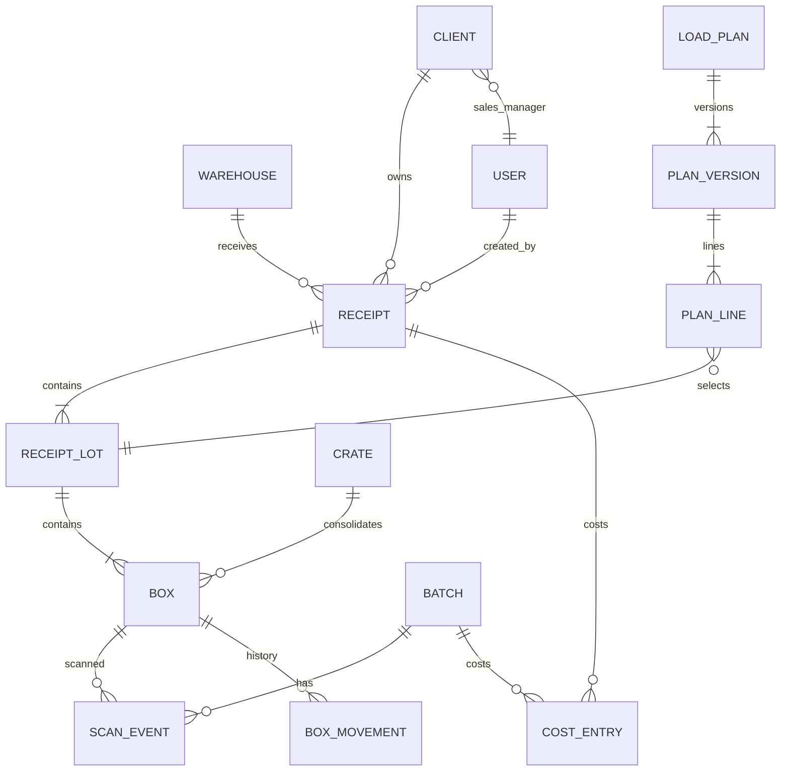

# GSR LOGISTICS ERP — Phase 1: WMS

## Build Specification & AI Prompt — v1.0

> 🇺🇿 **Bu hujjat nima?** Bu — GSR LOGISTICS uchun ERP platformasining 1-bosqichi (WMS — Sklad Boshqaruv Tizimi)ni AI yordamida (Claude Code, Cursor va h.k.) qurish uchun to'liq texnik topshiriq (prompt). Hujjatni to'liligicha AI vositaga bering va "Build Milestone M0" deb boshlang. Har bir bo'limda 🇺🇿 belgisi bilan o'zbekcha izoh berilgan.

---

## 0. How to use this document

**For the human (Bekzod / team):**

1. Feed this entire document to your AI coding agent (Claude Code recommended).
2. Tell it: *"Read the full spec. Then implement Milestone M0. After each milestone, stop, demo, and wait for my approval before continuing."*
3. Review each milestone on a real Android phone before approving the next one.

**For the AI coding agent:**

- This document is your single source of truth. Read it fully before writing any code.
- Build milestone by milestone (Section 19). Do not skip ahead. Do not gold-plate.
- If a requirement is ambiguous, choose the simplest interpretation that satisfies the acceptance tests (Section 20), note the decision in `DECISIONS.md`, and continue.
- Every milestone must end with: working seed data, passing tests, and a short `CHANGELOG.md` entry.
- Mobile-first is not optional. Every operational screen must be verified at 360×800 viewport first, desktop second.

> 🇺🇿 **Izoh:** AI agentga shu hujjatni berib, bosqichma-bosqich (M0 → M6) qurdirasiz. Har bosqichdan keyin telefonda tekshirib, keyingisiga ruxsat berasiz.

---

## 1. Business context (the company and how it operates)

GSR LOGISTICS is a cargo consolidation ("kargo") company moving goods **from China to Uzbekistan**.

**Warehouse network:**

| Code | City | Country | Role |
|------|------|---------|------|
| GZ | Guangzhou | China | Origin receiving warehouse |
| YW | Yiwu | China | Origin receiving warehouse |
| UCH | Urumqi | China | Origin receiving warehouse |
| KA | Kashgar | China | Consolidation hub (origin WHs truck cargo here; export trucks to UZ depart from here) |
| AND | Andijan | Uzbekistan | Customs/bonded warehouse (rastamojka; some clients pick up here) |
| TAS1, TAS2, … | Tashkent | Uzbekistan | Distribution warehouses (2–4 of them, list changes over time; clients pick up here) |

Warehouses must be **fully data-driven** (admin can add/edit/deactivate warehouses, codes, types, timezones). Never hardcode the list.

**The flow of goods:**

1. Clients (importers) buy goods in China. Each client has a unique code like `GS777`. Suppliers ship boxes marked with that code to one of our China warehouses.
2. Warehouse operator (skladchi) receives, measures, weighs, photographs cargo, enters it into the system, prints a QR label ("sticker") for every box, sticks it on.
3. Cargo from GZ / YW / UCH is trucked to KA (each truck = a **batch** like `YW-001`).
4. At KA a logistics manager (logist) plans export trucks to Uzbekistan (batch like `KA-001`), gets the load plan approved by an external Chinese export agent (via WeChat, outside the system), then the truck is loaded with per-box scanning.
5. VED manager prepares invoice + packing list for customs from the actual loaded manifest.
6. Truck arrives at a UZ customs warehouse (AND or Tashkent). After customs clearance cargo is either picked up by clients there or trucked on to Tashkent distribution warehouses.
7. Clients are notified and cargo is handed over (scanned out).

**Team roles today:** warehouse operators (one per WH + ~5 loaders who don't use the system), logist (plans all truck loads), VED manager (customs docs), sales managers (each client is assigned to one), director/admin.

> 🇺🇿 **Izoh:** Bu bo'lim biznesingizni AI'ga tushuntiradi. E'tibor bering: skladlar ro'yxati qattiq kodlanmaydi — admin panelda istalgancha sklad qo'shish/o'chirish mumkin bo'ladi (Toshkentda 2-3-4 sklad ishlatishingiz shuni talab qiladi).

---

## 2. Platform vision & module roadmap

We are building a **modular ERP platform**, not a single app. Phase 1 = WMS. The architecture must make later modules cheap to add.

| Phase | Module | Scope (later phases are OUT of scope now, but the foundation must anticipate them) |
|-------|--------|-------|
| 1 | **WMS** (this spec) | Receiving, labeling, stock, transfers, load planning, scanning, batches, landed-cost capture, handover |
| 2 | **CRM** | Clients, leads, tariffs (price per kg / per m³ by density), client Telegram bot, client portal with track-and-trace, sales funnel |
| 3 | **Finance** | Invoicing clients, payments, debtors, cash/bank, batch P&L (client revenue − landed cost), expenses, multi-currency GL |
| 4 | **HR & Payroll** | Staff, attendance, salary, loader piece-work |
| 5+ | Fleet, customs-declaration helper, API for partner agents | |

**Architectural consequences for Phase 1:**

- Single monorepo, modular folder structure (`modules/wms`, `modules/platform`, future `modules/crm`…).
- Shared platform core: auth, users, roles, audit, notifications, files, i18n, settings, clients registry (clients live in platform core — CRM will extend them, WMS references them).
- Every quantity/money value stored precisely (see 4.6) so Finance can trust WMS data later.
- Domain events (see 4.7) so future modules can subscribe (e.g., Finance reacts to `BatchDeparted`).

> 🇺🇿 **Izoh:** Hozir faqat WMS quriladi, lekin poydevor (login, rollar, audit, mijozlar ro'yxati, hujjatlar, valyuta) shunday quriladiki — CRM va Moliya modullari keyin shu poydevorga "taqilib" ketadi, qayta qurish kerak bo'lmaydi.

---

## 3. Tech stack (Node.js / TypeScript)

**Required stack — do not substitute without a written reason in `DECISIONS.md`:**

| Layer | Choice | Why |
|-------|--------|-----|
| Language | TypeScript everywhere (strict mode) | one language, AI-friendly, type safety |
| Framework | **Next.js 15+ (App Router)** running on Node.js — single full-stack app | fastest to build/iterate, SSR for speed on slow networks, API routes + server actions |
| DB | **PostgreSQL 16+** | reliability, JSONB for flexible attrs, window functions for reports |
| ORM | **Drizzle ORM** (or Prisma if Drizzle blocks progress) | typed schema, migrations |
| Cache/queue | **pg-boss** (Postgres-based job queue) — no Redis in v1 | fewer moving parts; jobs: Telegram sends, thumbnail generation, Excel builds |
| Files | S3-compatible object storage (Cloudflare R2 or MinIO on the VPS) | photos, attachments, generated Excel/PDF |
| Images | client-side compression before upload (`browser-image-compression`, target ≤ 300 KB) + server thumbnails via `sharp` (200px, 800px) | warehouse internet is weak |
| Auth | Session cookies (httpOnly) + Argon2 password hashing; short-lived JWT only if needed for the print helper | simple, secure |
| i18n | `next-intl`; locales: `ru` (default), `uz` (Latin), `zh-CN` | staff mix in UZ + China |
| QR scanning | Native `BarcodeDetector` API when available, fallback `@zxing/browser`; continuous scan mode; also accept USB/Bluetooth HID scanners (they type the code + Enter) | phone camera first, hardware scanners later |
| Label printing | Server generates **100×100 mm PDF** (pdf-lib) per box; print via OS dialog / RawBT (Android) / any thermal label printer (Xprinter etc., 203 dpi). Architecture allows adding direct TSPL/ZPL later. | thermal printers confirmed by owner |
| QR content | plain short code string, e.g. `YW26-000123` (box) / `CR-YW26-00012` (crate) — nothing else in the QR | short = fast, scratched-label tolerant; same code goes into RFID EPC later |
| Excel | `exceljs` — must support embedded photo thumbnails in cells (agent approval file requires photos) | their agent workflow lives in Excel |
| Realtime | Server-Sent Events (SSE) for loading-mode progress and plan updates | simpler than websockets, proxy-friendly |
| Offline | PWA (Serwist/next-pwa): app shell cached; **offline outbox in IndexedDB for scan events and receipt drafts**, background sync with client-generated idempotency UUIDs | Chinese warehouse internet drops; scanning must never block |
| Charts | lightweight (recharts) — dashboards only | |
| Tests | Vitest (unit: letter sequencer, cost allocation, code generators) + Playwright (e2e happy paths, mobile viewport) | |
| Deploy | Docker Compose (app + postgres + minio) on a VPS. **Hosting note:** pick a region reachable from mainland China without VPN (Hong Kong / Singapore, e.g. Alibaba/Tencent HK). Self-host all fonts/assets; zero Google/Facebook CDN dependencies (blocked in CN). | GZ/YW/UCH/KA staff must get fast page loads |
| Time | store UTC in DB; every warehouse has a timezone (`Asia/Shanghai`, `Asia/Tashkent`); display/print in warehouse-local time | stickers must show the local receiving date |

> 🇺🇿 **Izoh:** Siz "Node" dedingiz — eng samarali Node varianti shu: Next.js (Node.js ustida ishlaydi) + PostgreSQL. Bitta ilova ham sayt, ham server, telefonga PWA sifatida o'rnatiladi. Muhim nuqta: server Xitoydan VPNsiz ochiladigan joyda turishi kerak (Hong Kong / Singapur), Google shriftlari ishlatilmaydi — Xitoyda bloklangan.

---

## 4. Platform foundation (cross-module core)

### 4.1 Authentication & users

- Login: phone number (or username) + password. Argon2id hashing. Rate-limited (5 tries / 15 min / IP+account).
- Sessions: httpOnly secure cookies, 30-day refresh, device list in profile ("logout other devices").
- Users have: full name, phone, role(s), assigned warehouse(s), UI language, Telegram link status, active flag.
- Admin creates users; no self-registration in Phase 1.
- Optional 4-digit quick-PIN re-lock for shared warehouse phones (config flag, off by default).

### 4.2 RBAC (roles & permissions)

Roles (seed): `super_admin`, `admin`, `logist`, `ved_manager`, `warehouse_manager`, `warehouse_operator`, `sales_manager`, `accountant`, `viewer`.

- Warehouse-scoped roles (`warehouse_manager`, `warehouse_operator`) only see/act on their assigned warehouse(s).
- `sales_manager` sees only their own clients' cargo (read) + receives notifications.
- Permission checks are **server-side on every mutation**; UI hiding is cosmetic only.
- Full permission matrix in Section 16.

### 4.3 Audit log (non-negotiable, requirement from the owner)

- Append-only `audit_log`: actor, entity type+id, action, **before/after JSON diff**, warehouse context, IP, user-agent, timestamp.
- Every create/update/void/status-change/scan/print/export is audited. No exceptions.
- DB user for the app has no UPDATE/DELETE grant on `audit_log`.
- UI: (a) "History" tab on every entity (receipt, box, plan, batch, client) showing a human-readable timeline ("Aziz changed weight 25 → 28 kg, 14:32"); (b) admin-only global audit browser with filters (user, entity, date, warehouse).

> 🇺🇿 **Izoh:** Sizning 2-talabingiz: "kim nima qilgani ko'rinib tursin". Har bir o'zgarish — kim, qachon, nimani nimaga o'zgartirdi — o'chirib bo'lmaydigan jurnalda qoladi.

### 4.4 Editability with control (requirement from the owner)

- Nothing is hard-deleted. Documents are **voided** with a mandatory reason; boxes/lots are edited with audit trail.
- Receipt edit rules: creator can edit freely same warehouse-day; after that, `warehouse_manager`/`logist`/`admin` can edit. Every field change lands in the audit timeline.
- If box count of a lot is reduced/increased after labels were printed, system flags label reconciliation ("2 labels now orphaned — confirm destroyed" / "3 new labels to print").

### 4.5 Notifications engine

- Channels: **Telegram bot** (grammY) + in-app notification center (bell icon). Architecture allows SMS/WhatsApp later.
- Staff link Telegram via deep-link: profile → "Connect Telegram" → opens `t.me/<bot>?start=<one-time-code>`.
- All sends go through the job queue with retry; delivery status visible to admins.
- Event→recipient rules in Section 11.

### 4.6 Money, units, precision

- Weights: kg, `NUMERIC(12,3)`. Dimensions: cm, integers. Volume: m³, `NUMERIC(12,4)`, computed `L×W×H/1,000,000` per box × count.
- Money: `NUMERIC(14,2)` + currency code (`CNY`, `USD`, `UZS` seeded; extensible). Manual FX rate table (admin enters; each rate dated). Every cost stores original amount+currency and is converted to **USD as the costing base** using the rate on the cost date (rate editable → allocations recompute).
- Chargeable weight (for future tariffs & optional allocation basis): `max(actual_kg, volume_m³ × factor)`, factor configurable, default 167 kg/m³.
- Density of a lot: `kg / m³` — displayed everywhere as a badge: 🔴 heavy ≥ 400, 🟠 300–400, 🟢 200–300, 🔵 light < 200 (thresholds configurable).

### 4.7 Domain events (internal)

Emit typed events in-process (and store in an `events` table): `ReceiptConfirmed`, `BoxLabeled`, `CrateFormed`, `PlanApproved`, `BatchDeparted`, `BoxScannedOnLoad`, `BatchUnloaded`, `BoxIssued`, `UnknownCargoReceived`, `CostEntryAdded`… Notifications and future modules (Finance/CRM) subscribe to these. Keeps modules decoupled.

### 4.8 Files & attachments

- Any entity (receipt, lot, batch, plan, cost entry, client) can hold attachments: photos, PDF, Word, Excel.
- Photos: EXIF-stripped, compressed client-side, thumbnails server-side; tap-to-zoom gallery UI.
- All access via signed URLs; no public bucket.

> 🇺🇿 **Izoh:** Bu poydevor bo'limi — login, rollar, audit, xabarnomalar, pul/valyuta aniqligi. Bularni bir marta to'g'ri qursak, CRM va Moliya ham shulardan foydalanadi.

---

## 5. Core domain model

### 5.1 Entities (main tables)

| Entity | Purpose | Key fields (not exhaustive) |
|--------|---------|------------|
| `warehouses` | all WHs, CN + UZ | code (GZ/YW/UCH/KA/AND/TAS1…), name, country, type (`origin`/`hub`/`customs`/`distribution`), timezone, batch_prefix, letter sequence state, active |
| `clients` | client registry (platform core, CRM extends later) | client_code (`GS777`, unique, uppercase), name, phone(s), assigned `sales_manager_id`, telegram/wechat note, active, notes |
| `receipts` | one receiving act (prixod) at a warehouse | number `YW-IN-260722-003`, warehouse, client (nullable ⇒ unclaimed), status (`draft`/`confirmed`/`voided`), received_at (WH-local), created_by, source note ("who delivered"), attachments |
| `receipt_lots` | one product group inside a receipt (this is what gets the LETTER) | letter (`A`…`ZZ`), cycle_no, product_name_zh, product_name_ru, box_count, dims mode (`uniform`/`mixed`), per-box L/W/H (uniform) or totals, weight per box / total, computed volume+density, photos |
| `boxes` | **the atomic tracked unit** — one physical box | short_code `YW26-000123`, lot_id, seq_in_lot (i of N), status, current_warehouse_id (nullable), current_batch_id (nullable), crate_id (nullable), label_printed_at, damaged flag |
| `crates` | wooden crate consolidating boxes (yashik) | code `CR-YW26-00012`, warehouse, status, measured dims/weight after packing, contents = boxes, photos, built_by |
| `batches` | one truck trip between two WHs | code `YW-001` (prefix = origin WH, per-WH sequence), origin_wh, dest_wh, type (`transfer`/`export`/`distribution`), status, vehicle plate/driver/phone/photos, departed_at, arrived_at, docs (invoice/packing list files) |
| `load_plans` | plan of what to load for a (future) batch | batch_id, status, versions (see 5.4), truck preset (max kg / max m³), created_by |
| `load_plan_lines` | lot (or partial lot) selected into a plan | plan_version, lot_id, planned_box_count (≤ lot remainder), planned kg/m³ snapshot |
| `scan_events` | every scan/manual-confirm during load/unload/issue | box_id, batch_id, type (`load`/`unload`/`issue`), method (`qr`/`manual`), reason if manual, client_event_uuid (idempotency), scanned_by, ts |
| `box_movements` | append-only location/status history per box (the timeline) | box_id, from → to (warehouse/batch/crate/status), cause (receipt/scan/auto-transfer/edit/issue), ref ids |
| `cost_entries` | any real-world expense captured | scope (`receipt`/`batch`), type (crating, freight, agent fee, customs, unload, other — admin-managed types), amount+currency, USD converted, allocation basis (`weight`/`volume`/`chargeable`/`boxes`/`direct_to_client`), note, attachments, entered_by |
| `product_dictionary` | zh → ru (+uz optional) product names | zh, ru, usage_count; grows automatically from receipts |
| `fx_rates` | manual currency rates | from, to, rate, date, entered_by |
| `truck_presets` | truck capacity templates | name ("13.5m tent"), max_kg, max_m³ |
| `letter_blacklist` | excluded 2-letter combos | seeded: `AM`, `XU` (admin-editable) |
| `notifications`, `telegram_links`, `audit_log`, `events`, `attachments`, `users`, `settings` | platform | |

### 5.2 Identifiers & codes (spec)

| Thing | Format | Example | Notes |
|-------|--------|---------|-------|
| Client code | `GS` + digits (config prefix) | `GS777` | uniqueness enforced; case-insensitive input, stored uppercase |
| Receipt number | `{WH}-IN-{YYMMDD}-{seq}` | `YW-IN-260722-003` | seq per WH per day |
| Box short code | `{WH}{YY}-{000000}` | `YW26-000123` | globally unique, per-WH-per-year sequence; **this exact string is the QR payload**; later the same string becomes the RFID EPC user memory → zero remapping when RFID arrives |
| Crate code | `CR-{WH}{YY}-{00000}` | `CR-KA26-00012` | crate QR payload |
| Lot letter | `A`…`Z`, then `AA`…`ZZ` | `D`, `AB` | see 5.3 |
| Batch code | `{WH_prefix}-{000}` | `YW-001`, `KA-014` | per-origin-WH sequence, admin can set prefix per WH |

### 5.3 Letter sequencing (exact algorithm — owner's rule)

> 🇺🇿 **Izoh:** Sizning qoidangiz: har qabuldagi har bir tovar turi navbatdagi harfni oladi, qabuldan qabulga davom etadi (A,B,C → keyingi qabul D dan), Z dan keyin AA…ZZ, ZZ dan keyin yana A. Haqoratli birikmalar (AM, XU…) tashlab ketiladi.

- One letter counter **per warehouse** (independent between warehouses; sticker also shows WH code, so no confusion). *(Config flag `LETTER_SCOPE=warehouse|global`, default `warehouse` — owner can switch.)*
- Sequence: `A, B, … Z, AA, AB, … AZ, BA, … ZZ`, then wrap to `A` again (cycle_no increments).
- Skip any combo in `letter_blacklist` (seed `AM`, `XU`; admin-editable). Optional config to also skip easily-confused single letters `I`, `O` (default off).
- Assignment happens at **receipt confirmation**, one letter per lot, inside a DB transaction with the warehouse row locked (`SELECT … FOR UPDATE`) — two operators confirming simultaneously must never get the same letter.
- Letter is immutable after confirmation (voiding a receipt does NOT return letters to the pool).
- Unit tests required: ordering, blacklist skip, ZZ→A wrap with cycle_no bump, concurrency.

### 5.4 Load plan versioning (agent approval loop)

Plan status machine:

`draft → pending_agent → (approved | changes_requested) → [edit ⇒ new version ⇒ pending_agent again] → approved → loading → completed / cancelled`

- Every submission snapshot is an immutable **version** (v1, v2…): lines, totals, generated Excel file. The agent's reply (approve / "remove item X" + comment, optional screenshot) is recorded manually by the logist — the agent stays on WeChat, outside the system.
- The batch is created from the **approved** version; later on-the-spot changes during loading are tracked as deviations (Section 6.5), not new versions.

### 5.5 Box status machine

```
received → in_stock ⇄ crated(inside crate)
in_stock → planned (reserved by approved plan)
planned/in_stock → loading → in_transit (batch departed)
in_transit → in_stock (at destination, after unload scan)
in_stock(final WH) → ready_for_pickup → issued
any → lost / void (with reason, manager-only)
```

- `box_movements` records every arrow with cause + actor.
- A crate moves as one unit: scanning the crate QR = scanning all boxes inside it.

### 5.6 ER sketch (mermaid)



---

## 6. WMS functional spec — workflows

### 6.1 W1 — Inbound receiving at a China warehouse (THE core mobile flow)

> 🇺🇿 **Izoh:** Skladchining asosiy ish quroli. Telefonda 2-3 daqiqada bitta qabulni kiritib, stikerlarni chiqarib olishi kerak. Qadam-baqadam "wizard" ko'rinishida.

Mobile stepper: **Client → Lots → Extra costs → Review → Confirm → Print**

1. **Client**: operator types/scans client code. Autocomplete from registry with fuzzy match (`gs777` → `GS777`). Shows client name + sales manager avatar as confirmation.
   - **Unknown code path**: "Kod topilmadi → Aniqlanmagan yuk sifatida qabul qilish" — receipt saved with `client=null`, goes to the **Unclaimed pool** (Section 6.7). Photos become mandatory.
2. **Lots** (repeatable "Add product" card), per product group:
   - `product_name_zh` — Chinese input with autocomplete from `product_dictionary`; on match/translate, **Russian translation shown right next to it in parentheses** and saved to `product_name_ru` (editable). Translation source: dictionary hit → else translation API (server-side, provider configurable: DeepL/Yandex/Google; cache every result into the dictionary; if API unavailable, field stays empty for manual entry — never block the flow).
   - `box_count` (integer).
   - Dimensions mode toggle:
     - **Uniform** (default): L×W×H (cm) + weight of ONE box → system multiplies by count. *(This mirrors how the operator works: measure one of 10 identical boxes.)*
     - **Mixed**: total volume (m³) + total weight (kg) entered directly (when boxes differ and measuring each is impractical). Optional per-box list for the diligent.
   - Photos: camera button, multi-shot, compressed; at least 1 photo required per lot.
   - Attachments: supplier's packing list / invoice (PDF/Word/Excel/photo) if the deliverer provided info.
   - Live computed: volume m³, density kg/m³ with color badge, chargeable weight.
   - Letter: shown as "will be assigned on confirm" (preview of next letters, e.g. "≈ D, E, F").
3. **Extra costs** (optional): type (from admin-managed list: crating/unload/other), amount + currency (CNY default at CN WHs), note, photo of receipt. *(Owner's rule: skladchi enters reception-level expenses like wooden crates.)*
4. **Review**: full summary, totals (boxes / kg / m³), warnings (missing photo, zero weight).
5. **Confirm** (single tap): transaction assigns letters, generates boxes with short codes, writes movements, emits `ReceiptConfirmed`, fires Telegram to the client's sales manager.
6. **Print labels**: one PDF (100×100 mm pages, one per box) — auto-download/print dialog; per-lot reprint buttons. Label spec in Section 7.

Post-confirm: edit per rules 4.4; every change audited; label reconciliation warnings on count changes.

**Speed bar:** operator with a mid-range Android must complete a 3-lot receipt in under 3 minutes on 3G. Autosave draft locally after every field (survives app kill / connection loss).

### 6.2 W2 — Crating (wooden box consolidation)

> 🇺🇿 **Izoh:** Siniydigan tovarlarni logist ruxsati bilan yog'och yashikka jamlash. Keyin tracking yashik bo'yicha yuradi.

- From stock view: select boxes (scan or tap) → "Yashikka joylash / Create crate".
- Requires a confirmation checkbox "Logist approved" (+ optional note) — mirrors the real ask-the-logist step without blocking on an in-app approval.
- Crate gets: own QR label (Section 7 variant), measured final dims + weight, photos, contents list.
- Crating cost → cost entry (type `crating`) linked to the receipt/client.
- Crate scans substitute for member-box scans everywhere (load/unload/issue). Crates can be dissolved (boxes revert to individual tracking; audited).
- Boxes from **multiple lots of the same client** may share a crate (v1 restriction: one client per crate — cross-client crates rejected with a clear error).

### 6.3 W3 — Load planning (logist)

> 🇺🇿 **Izoh:** Logist mashina sig'imiga qarab yuklarni belgilaydi (check/uncheck), jonli hisoblagich umumiy kg/m³ ni ko'rsatib turadi. Excel (rasmlar bilan) eksport — agentga tasdiqlash uchun.

- New plan: origin WH → destination WH, truck preset (or custom max kg / max m³), optional target date.
- **Selection table** (desktop-friendly, works on tablet): all `in_stock` lots at origin with columns: client code+letter, product (zh/ru), boxes available, kg, m³, density badge, days-in-stock, photos popover.
  - Check/uncheck whole lots or set **partial box count** (e.g. 50 of 100 — owner's real case).
  - Sticky live footer: Σ boxes, Σ kg (% of max, progress bar), Σ m³ (% of max, progress bar), avg density. Over-capacity turns red but does not hard-block (real trucks flex).
  - Filters: client, product, density range, receipt date; sort by oldest first (FIFO nudge).
- **Excel export "Agent approval file"**: one row per lot — embedded photo thumbnail, product zh (ru), client code+letter, boxes, kg, m³; totals row; batch draft code; generated file stored on the plan version.
- Approval loop per 5.4. On `changes_requested`, logist edits (uncheck/reduce) → new version → export again.
- On `approved`: batch record created (code assigned, e.g. `KA-014`), boxes get `planned` reservation (prevents double-planning the same box into two trucks).
- Vehicle registration (when truck arrives): plate, driver name+phone, truck photos — entered by skladchi or logist on the batch card. *(Owner's flow: skladchi photographs the truck and reports; here they enter it directly.)*

### 6.4 W4 — Loading execution (scanning at origin)

> 🇺🇿 **Izoh:** Yuklash rejimi — telefonda katta skaner oynasi. Har karobka skan qilinadi. Stiker yo'qolgan/shikastlangan bo'lsa — qo'lda topib belgilash. Rejadan tashqari yuk — logist bilan. Sig'may qolsa — qisqartirish hujjatlashtiriladi.

Full-screen **Loading mode** on the batch:

- Continuous camera scan; each successful scan: vibration + beep + green flash + running counter `137 / 220`. Per-lot progress list below (client+letter: 12/50…). Works offline (outbox queue, syncs when back).
- Scan outcomes:
  - ✅ On plan → counted.
  - 🔁 Duplicate scan → ignored with soft warning.
  - ⚠️ **Not on plan** → red screen: "Rejada yo'q!" Options: `Cancel` or `Load anyway` (requires reason; flagged `added_on_spot`; logist notified instantly via Telegram + SSE). *(Covers "space left, logist said add more via WeChat" — logist can also live-add lots to the plan from their screen; worker's list updates via SSE.)*
  - 🏷️ **Sticker lost/damaged**: button "Stikersiz yuk" → search by client code + letter → shows that lot's unscanned boxes → select → mark `manual (sticker lost)` + optional photo; offer label reprint.
- **Finish loading** → discrepancy summary:
  - Planned-not-loaded → stays `in_stock`, flagged `short_loaded` (owner's "sig'may qoldi" case), listed in report, logist notified.
  - Loaded-not-planned → flagged `added_on_spot`.
  - Actual totals (kg/m³ from box data) vs plan totals.
- **Depart** (logist or manager confirms): batch → `in_transit`; all scanned boxes/crates → `in_transit`; stock at origin decremented; `BatchDeparted` event; **actual manifest** (Excel) generated for the VED manager — this is the "what was really loaded" document.
- Loading screen shows each lot's density badge and a hint sort "heavy first" (owner: heavy below, light on top).

**Reality rule (owner):** loaders sometimes load boxes *without* scanning. The system tolerates this: unload scanning at destination is the reconciliation point (see W5) — nothing hard-blocks on load-scan completeness, it only reports.

### 6.5 W5 — Unloading / receiving a transfer (destination WH)

> 🇺🇿 **Izoh:** Qashqarda (yoki UZ skladida) tushirishda har karobka skan qilinadi. Manifestda yo'q karobka chiqsa — tizim uni avtomatik shu skladga "ko'chiradi" (sizning talabingiz), bayroqcha bilan.

**Unload mode** on the incoming batch (same scanner UX):

- Scan each box/crate:
  - ✅ On manifest → received into this WH (`in_stock` here).
  - ⚠️ **Not on this manifest but exists in system** (e.g., loaded without scan at origin, or from another WH entirely): accept + **auto-transfer** — system moves the box to THIS warehouse regardless of its previous recorded location, sets flag `undocumented_transfer`, records the correcting movement, notifies logist. *(Owner's exact requirement: "realniy borib qolgan sklatga tushib qolishi kerak".)*
  - ❓ Unknown QR → treat as unknown cargo intake (mini-form + photo, goes to Unclaimed pool of this WH).
- Sticker damaged → same manual search flow as loading.
- **Finish unload** → reconciliation report:
  - On manifest, never scanned here → flag `missing_in_transit` (box stays `in_transit`, alert to logist; resolvable later: "found at origin" → returns to origin stock / "found here" → late scan).
  - Batch → `unloaded`/`closed`; arrival timestamp; costs can now be attached.

### 6.6 W6 — Export documents (VED manager)

> 🇺🇿 **Izoh:** VED manager fakticheskiy yuklangan manifest asosida invoice va packing list tayyorlaydi. Tizim Excel qoralamalarini o'zi yasab beradi — VED faqat narxlarni kiritib tahrirlaydi.

- On any `export` batch after loading: **Generate Invoice draft** + **Generate Packing List draft** (Excel, templates with configurable company header/consignee/stamp block).
  - Packing list: rows per lot (or per crate), boxes, kg, m³ — pulled from actual manifest.
  - Invoice: same rows + editable unit prices/descriptions (VED adjusts; customs values are their business decision, system just drafts).
- Files stored on the batch (versioned); "sent to agent" checkbox + date. Documents travel with the truck physically — the system is the archive.

### 6.7 W7 — Unknown / unclaimed cargo

> 🇺🇿 **Izoh:** Kod noma'lum yuklar alohida "Aniqlanmagan yuklar" bo'limida turadi. Keyin mijozga biriktiriladi (mijoz kodni adashtirgan bo'lsa) yoki qaytarib yuboriladi.

- Unclaimed receipts pool per WH: photos, measurements, deliverer note, date.
- Actions: **Assign to client** (search client → confirm; boxes stay, labels can be reprinted with client code; sales manager notified; fully audited) | **Return to sender** (handover record: who took it, phone, photo/signature; boxes → `issued` with reason `returned_to_sender`).
- Aging alert: unclaimed > N days (config, default 7) → daily Telegram digest to logist + admin.

### 6.8 W8 — Uzbekistan side: customs arrival, distribution, handover

> 🇺🇿 **Izoh:** Mashina AND yoki Toshkentga keladi, tushiriladi (W5 bilan bir xil), mijozlar xabardor qilinadi, yuk skan qilinib topshiriladi. Toshkent ichida bir necha sklad bo'lishi mumkin — hammasi oddiy transfer batch sifatida yuritiladi.

- Arrival at customs WH (AND / TAS*) = normal unload (W5). Internal AND→TAS or TAS1→TAS2 moves = normal transfer batches (plan optional — "quick batch" mode: create batch + scan-load without agent approval).
- After unload at a `customs`/`distribution` WH, each client's boxes become `ready_for_pickup`; per-client arrival summary auto-drafted.
- **Client notification (Phase 1):** Telegram to the sales manager with per-client summary + a "Share" button producing a ready client message (uz/ru template: products, boxes, kg, WH address) the manager forwards via their own Telegram/WhatsApp. *(Phase 2 CRM: direct client bot with track-and-trace.)*
- **Handover (Issue mode):** select client at WH → their `ready_for_pickup` boxes listed → scan-out each (or crate) → receiver name + phone (+ optional photo / signature scribble) → confirm → boxes `issued`, PDF handover act optional, sales manager notified. Partial pickup fine (rest stays).
- Guard rail hook (Finance later): `settings.block_issue_if_unpaid` — Phase 1 just a manual "debt OK" checkbox slot, no logic.

### 6.9 W9 — Landed cost (tan narx) capture & allocation

> 🇺🇿 **Izoh:** Sizning misolingiz: bitta yuk YW-001 da, boshqasi GZ-001 da kelib, ikkalasi KA-001 ga yuklansa — tan narxlari har xil bo'ladi. Tizim buni box darajasida avtomatik hisoblaydi: har karobka o'zi qatnashgan har bir partiya xarajatidan o'z ulushini oladi.

- Cost entries attach to **receipts** (crating, local handling — skladchi enters) or **batches** (freight, agent fee, border/customs fees, unloading — logist/VED/accountant enters), any currency, converted to USD by dated FX rate.
- Each entry has an **allocation basis**: by weight (default for freight) / by volume / by chargeable weight / by box count / direct-to-client.
- **Allocation engine** (pure function, heavily unit-tested): a batch's cost is distributed over the boxes actually on that batch; a receipt's cost over that receipt's boxes. A box's **landed cost = Σ shares across its whole journey** (receipt + every batch it rode).
  - Worked example (must be a passing test): box P rides `YW-001` (freight 10,000 CNY over 10,000 kg total → 1 CNY/kg) then `KA-001` (freight 40,000 CNY over 20,000 kg → 2 CNY/kg). Box P is 30 kg ⇒ 30 + 60 = 90 CNY (converted to USD by each entry's rate). Box Q same `KA-001` but arrived via `GZ-001` gets a different first-leg share ⇒ different landed cost.
- Recompute on any cost/rate edit (idempotent job), full audit.
- Reports: batch cost sheet (entries + per-kg/per-m³ unit cost), per-client landed cost by lot, unclaimed-cost warnings (batch with 0 costs departed > N days).
- Phase 3 Finance consumes these numbers for client pricing/margin — do not build invoicing to clients now.

---

## 7. Label ("sticker") specification

> 🇺🇿 **Izoh:** Stiker — tizimning yuragi. Klient kodi + harf uzoqdan o'qiladigan darajada KATTA bo'ladi (sizning talabingiz), QR esa skanerga qulay.

**Format: 100×100 mm thermal (203 dpi), generated as PDF, one page per box.**

```
┌─────────────────────────────────────┐
│  YW          22.07.2026   YW-IN-260722-003
│                                     │
│        G S 7 7 7 – A                │   ← client code + lot letter,
│                                     │     ~22 mm tall, extra-bold
│  化妆品 (Косметика)                  │   ← product zh (ru)
│  Box 3 / 10        25.0 kg  50×50×50│
│                                     │
│  ▓▓▓▓▓▓▓                            │
│  ▓▓QR▓▓▓   YW26-000123              │   ← QR ≥ 32×32 mm, quiet zone;
│  ▓▓▓▓▓▓▓   GSR LOGISTICS            │     short code as text fallback
└─────────────────────────────────────┘
```

Rules:

- Client code + letter is the **dominant element** (readable from 2–3 m). Unclaimed cargo prints `#UNKNOWN` + receipt number in its place.
- QR payload = box short code string only. Human-readable code printed under the QR (manual entry fallback when QR is scratched).
- Date in warehouse-local time. WH code top-left, huge enough to sort by destination at a glance.
- Crate label: same layout; `CR-…` code, contents count ("18 boxes / GS777: A×10, B×8"), and `КАРКАС/ЯЩИК` marker.
- Reprint anytime from receipt/lot/box screens (audited: who, when, which labels).
- Print path v1: PDF → OS print dialog (desktop) or RawBT/vendor app (Android → Bluetooth thermal). Keep a `LabelRenderer` interface so a direct TSPL driver can be added without touching callers.

---

## 8. Product dictionary & zh→ru translation

- `product_dictionary` rows: `zh`, `ru`, optional `uz`, `usage_count`, `verified` flag.
- Lookup order on input: exact dictionary hit → fuzzy dictionary suggestion → translation API (server-side; provider pluggable: DeepL / Yandex / Google via config; responses cached into dictionary as unverified).
- Admins can curate the dictionary (merge duplicates, verify, bulk import XLSX).
- Never block receiving on translation failure — `ru` field simply stays editable/empty.
- The translation shown in parentheses next to the zh input, exactly as the owner described: `键盘 (Клавиатура)`.

---

## 9. Generated documents (Excel/PDF) — exact list

| Doc | Trigger | Contents |
|-----|---------|----------|
| **Agent approval file** (xlsx) | plan version submit | rows per lot: embedded photo thumb, client+letter, product zh(ru), boxes, kg, m³; totals; plan/batch draft code, date |
| **Actual manifest** (xlsx) | batch departed | what was REALLY scanned/loaded incl. on-spot additions; per-client subtotals; for VED + destination WH |
| **Invoice draft** (xlsx) | VED, on export batch | configurable header (seller/buyer/consignee), rows w/ editable prices, totals, currency |
| **Packing list draft** (xlsx) | VED, on export batch | rows per lot/crate: pieces, kg, m³; totals; truck plate |
| **Handover act** (PDF, optional) | issue completed | client, boxes list, receiver, signature line |
| **Labels** (PDF 100×100) | receipt confirm / reprint | Section 7 |
| **Stock report** (xlsx) | on demand from stock browser | current filter applied |

All generated files are stored as attachments on their entity (immutable, versioned) — the system doubles as the document archive.

---

## 10. Screens (mobile-first UI spec)

> 🇺🇿 **Izoh:** Skladchi ekranlari telefonga, logist ekranlari planshet/kompyuterga mo'ljallanadi, lekin hammasi hamma qurilmada ishlaydi. Katta tugmalar, katta shrift, minimal yozish — ko'proq tanlash/skan.

**Operational (phone-first, thumb-reachable, huge tap targets ≥ 48 px):**

1. Login (+ PIN re-lock optional)
2. Home — role-aware shortcuts: big buttons "📥 Qabul / Приёмка", "🚚 Yuklash", "📤 Tushirish", "🤝 Topshirish", today's numbers
3. New Receipt wizard (W1)
4. Receipt list & detail (edit, void, reprint, audit timeline, attachments)
5. Unclaimed pool (W7)
6. Stock browser: WH → client → lot → box; each box has full timeline; global search everywhere (client code, letter, box code, product, plate no)
7. Crate builder (W2)
8. Loading mode (W4) / Unload mode (W5) / Issue mode (W8) — same full-screen scanner pattern
9. Notification center

**Management (desktop/tablet-first):**

10. Load plan editor (W3) with live capacity gauges
11. Batch board — kanban by status (Forming / Loading / In transit / Arrived / Closed) with vehicle info, docs, costs tabs
12. VED docs screen (W6)
13. Costs & FX (W9)
14. Reports (Section 13) & Dashboard
15. Admin: users/roles, warehouses, clients (+sales-manager binding, +Telegram), truck presets, cost types, letter blacklist, product dictionary, FX rates, settings, global audit browser

UI language switcher (ru/uz/zh) in the header; per-user default.

---

## 11. Notifications — event → recipient rules

| Event | Telegram to | Content |
|-------|-------------|---------|
| `ReceiptConfirmed` | client's **sales manager** (owner's requirement #3) | client code, WH, per-lot: product (ru), boxes, kg, m³; first photos; deep link |
| `UnknownCargoReceived` | logist + admins | WH, measurements, photos |
| `PlanChangesRequested/Approved` | logist | agent verdict + comment |
| `AddedOnSpot` / `ShortLoaded` (finish loading) | logist | deviations list |
| `UndocumentedTransfer` (rogue box at unload) | logist | box, expected vs actual WH |
| `MissingInTransit` | logist + origin WH manager | boxes not arrived |
| `BatchArrived/Unloaded` | logist, VED, sales managers of affected clients | per-client summary + share-to-client draft text |
| `ReadyForPickup` | sales manager (per client) | summary + WH address template (uz/ru) |
| `BoxIssued` | sales manager | who picked up, what remains |
| Unclaimed aging / stale stock digest | logist + admin (daily 09:00 WH time) | aged items list |

In-app bell mirrors everything. Per-user mute settings. All sends async via job queue with retry/backoff; failures visible in admin.

---

## 12. Search (global)

One search box, everywhere (`/` hotkey, sticky on mobile): matches client code, client name, box short code, lot letter+client (`gs777-a`), product name zh/ru, receipt no, batch code, truck plate, driver phone. Results grouped by type, tap → entity. Must return in < 300 ms on 100k boxes (trigram indexes).

---

## 13. Reports & dashboards

**Dashboard (role-aware):**

- Admin/logist: stock by WH (boxes/kg/m³), in-transit batches, today's receipts across WHs, unclaimed count, aging alerts, discrepancy flags.
- Warehouse manager/operator: their WH only + today's tasks.
- Sales manager: their clients' cargo pipeline (received → in transit → arrived → issued).

**Reports (all filterable, all exportable to XLSX):**

1. Current stock by warehouse / client / lot (with aging days, density)
2. Receipts journal (period, WH, operator)
3. Batch register + per-batch: manifest, deviations (short/added), costs, unit cost per kg & m³
4. In-transit / missing-in-transit
5. Unclaimed cargo
6. Client cargo history (full journey per lot/box)
7. Landed cost by client / by batch (W9)
8. Staff activity (from audit: receipts, scans, edits per user per day)
9. Label reprint log

---

## 14. Edge cases catalog (build these in from day one)

> 🇺🇿 **Izoh:** Bu bo'lim — real hayotda bo'ladigan "istisno" holatlar ro'yxati. Siz aytib bergan barcha vaziyatlar shu yerda jamlangan. AI bularni alohida "keyin qilamiz" demasdan, tegishli oqimlar bilan birga qurishi shart.

1. **Operator typo after confirm** → edit with audit (4.4); label reconciliation if counts change.
2. **Unknown client code arrives** → unclaimed intake; later assign-to-client (client used wrong code) or return-to-sender (6.7).
3. **Sticker lost/damaged** at load or unload → manual identify by client+letter → mark with reason → reprint (6.4/6.5).
4. **Loaders load without scanning** → tolerated; destination unload auto-transfers rogue boxes to where they physically are, flagged (6.5).
5. **Truck too small** → short-load flow: unloaded remainder stays in stock, flagged + reported (6.4).
6. **Truck has spare room** → on-spot additions with reason, or logist live-edits plan (6.4).
7. **Agent rejects part of plan** → versioned re-approval loop (5.4).
8. **Mixed/odd boxes, can't measure each** → lot "mixed" mode with totals (6.1).
9. **Fragile goods** → crate consolidation, crate-level tracking, crate cost entry (6.2).
10. **Same client, cargo split across trucks** (50 of 100) → partial plan lines; per-box batch history keeps costs correct (6.3, 6.9).
11. **Box physically vanishes** → `lost` status with reason, manager-only, shows in reports until resolved.
12. **Two operators receive simultaneously** → letter sequence is transactional, no duplicates (5.3).
13. **Offline warehouse** → receipt drafts + scans queue locally, sync later, idempotent (3, 6.4).
14. **Duplicate/late scan sync** → client-generated event UUIDs dedupe server-side.
15. **Wrong-warehouse receipt** (operator logged into wrong WH) → manager can move a whole receipt between WHs (audited correcting movements).
16. **Client code renamed / client merged** → history preserved via IDs; codes are labels, FKs are ids.
17. **Batch cost arrives weeks later** (customs invoice) → costs attachable to closed batches; landed cost recomputes.
18. **FX rate corrected** → same recompute path, audited.
19. **ZZ letter reached** → wraps to A, cycle_no distinguishes internally (5.3).
20. **Blacklisted letter combos** (AM, XU, …) → skipped automatically; admin can extend the list (5.3).

---

## 15. Non-functional requirements

| Area | Requirement |
|------|-------------|
| **Performance** | P75 page load < 3 s on mid-range Android over 3G; scan feedback < 300 ms (local-first); lists virtualized beyond 100 rows; images always thumbnails-first |
| **Mobile UX** | PWA installable (icon, splash); all operator flows one-hand usable; big touch targets; works in bright warehouse light (high contrast); no horizontal scroll at 360 px |
| **Offline** | receiving drafts + all scan modes fully functional offline; visible sync status banner; no data loss on app kill |
| **Reliability** | nightly `pg_dump` to object storage (30-day retention) + weekly restore test script; object storage versioning on |
| **Security** | server-side authz on every mutation; zod validation on every input; signed URLs; rate limiting; audit immutability; secrets via env; HTTPS only |
| **China access** | host reachable from mainland CN (HK/SG region); all assets self-hosted; no Google fonts/CDNs/analytics; test checklist item: page load from CN warehouse < 5 s |
| **i18n** | every UI string through i18n (ru/uz-Latn/zh-CN); no hardcoded text; dates/numbers localized; WH-local dates on prints |
| **Scale target** | 4–10 warehouses, 30–50 staff users, 2–5k clients, 3–5k boxes/month, 200k+ boxes over 3 years — index accordingly, no premature microservices |
| **Observability** | structured logs (pino), error tracking (Sentry-compatible, self-hostable GlitchTip ok), `/health` endpoint, job queue dashboard |
| **Code quality** | strict TS, ESLint+Prettier, migrations checked in, seed script, CI: typecheck+unit+e2e smoke |

---

## 16. Roles & permissions matrix

| Capability | super_admin | admin | logist | ved | wh_manager* | wh_operator* | sales_manager | accountant | viewer |
|---|---|---|---|---|---|---|---|---|---|
| Manage users/roles/settings | ✅ | ✅ | — | — | — | — | — | — | — |
| Manage warehouses/presets/dictionaries | ✅ | ✅ | — | — | — | — | — | — | — |
| Manage clients + manager binding | ✅ | ✅ | ✅ | — | — | — | own view | — | — |
| Create/edit receipts | ✅ | ✅ | ✅ | — | ✅ (own WH) | ✅ (own WH, same-day edit) | — | — | — |
| Void receipts / resolve unclaimed | ✅ | ✅ | ✅ | — | ✅ (own WH) | — | — | — | — |
| Crates | ✅ | ✅ | ✅ | — | ✅ | ✅ | — | — | — |
| Load plans (create/edit/submit/approve-record) | ✅ | ✅ | ✅ | — | — | — | — | — | — |
| Loading/unloading/issue scanning | ✅ | ✅ | ✅ | — | ✅ | ✅ | — | — | — |
| Batch depart/close, vehicle info | ✅ | ✅ | ✅ | — | ✅ | ✅ (vehicle info only) | — | — | — |
| VED docs generate/edit | ✅ | ✅ | — | ✅ | — | — | — | — | — |
| Cost entries + FX | ✅ | ✅ | ✅ (batch) | ✅ (batch) | ✅ (receipt, own WH) | ✅ (receipt, own WH) | — | ✅ all | — |
| Reports: all WHs | ✅ | ✅ | ✅ | ✅ | own WH | own WH | own clients | ✅ | read-all |
| Global audit browser | ✅ | ✅ | — | — | — | — | — | — | — |

\* scoped to assigned warehouse(s). Matrix is seed data — permissions are data-driven (role→permission table), not if-statements scattered in code.

---

## 17. Settings & configuration (admin-editable)

`letter_scope` (warehouse|global), `letter_blacklist` (list), `exclude_ambiguous_letters` (bool), `chargeable_weight_factor` (167), `density_thresholds` (200/300/400), `unclaimed_aging_days` (7), `stale_stock_days` (30), `costing_base_currency` (USD), `client_code_prefix` (GS), `label_size` (100×100), `translation_provider` (+keys), `telegram_bot_token`, `default_locale`, `pin_relock` (off), `block_issue_if_unpaid` (off, Phase 3 hook), truck presets, cost types, warehouses.

Env: `DATABASE_URL`, `S3_*`, `TELEGRAM_BOT_TOKEN`, `TRANSLATE_API_*`, `SENTRY_DSN`, `APP_URL`, `NODE_ENV`.

---

## 18. Seed / demo data (must ship with M1)

- Warehouses: GZ, YW, UCH, KA (China, `Asia/Shanghai`… KA `Asia/Kashgar` optional), AND, TAS1, TAS2 (`Asia/Tashkent`).
- Users: one of each role (password `demo1234`), operators bound to their WHs.
- Clients: `GS777` ("Alisher aka", sales manager Dilnoza), `GS102`, `GS205`… 20 demo clients.
- **The owner's canonical example as live data:** receipt at YW for `GS777`: 100 boxes = 化妆品 (Косметика) 10×(50×50×50, 25 kg) → letter A; 键盘 (Клавиатура) 50×(35×35×35, 30 kg) → B; 鼠标 (Мышь) 40 boxes mixed mode → C. Next receipt (GS102) starts at D.
- One batch `YW-001` YW→KA departed with partial load (50 of B), one `KA-001` KA→AND in approval loop, cost entries + FX rates matching the worked example in 6.9.
- Truck presets: "13.6m tent 90 m³ / 24 t", "17.5m 130 m³ / 28 t".
- Letter blacklist: `AM`, `XU`.

---

## 19. Build milestones (strict order)

> 🇺🇿 **Izoh:** Qurish tartibi. Har bosqich tugagach — telefon bilan sinab ko'rasiz, keyin davom ettirasiz. M1 tugashi bilanoq skladchilaringiz real ishlata boshlashi mumkin.

**M0 — Platform foundation (week-scale: small)**

Auth, users, RBAC, warehouses admin, clients admin (+sales manager binding), settings, audit log core + history tab component, i18n scaffold (ru/uz/zh), PWA shell, file upload pipeline, seed script, CI.

✅ *Done when:* admin creates a WH + client + operator on a phone; every change visible in audit browser.

**M1 — Receiving + labels + Telegram (the MVP that goes live)**

W1 wizard (uniform/mixed, photos, attachments, extra costs), letter sequencer (tested), box generation, label PDF + reprint, product dictionary + translation, unclaimed intake, edit rules + label reconciliation, `ReceiptConfirmed` Telegram to sales manager, receipt list/detail, stock browser v1, global search v1.

✅ *Done when:* the GS777 demo receipt can be entered on a phone in < 3 min, labels print, Dilnoza gets the Telegram.

**M2 — Stock ops**

Crates (W2), box timeline, voids, wrong-WH receipt move, unclaimed resolution flows, stale/unclaimed digests, stock report XLSX.

**M3 — Load planning & loading**

Truck presets, plan editor with live gauges + partial counts, versioning + agent approval loop, agent Excel with photos, batch creation + vehicle info, Loading mode (scan, offline outbox, not-on-plan / sticker-lost / duplicate handling), finish-loading deviations, depart + actual manifest XLSX, SSE live updates.

**M4 — Transfer receiving**

Unload mode (W5), auto-transfer of rogue boxes, missing-in-transit lifecycle, batch close, discrepancy reports, KA hub dashboard.

**M5 — Export & UZ side**

VED invoice/packing list generators, customs WH arrival, distribution transfer "quick batch", ready-for-pickup + client notify drafts, Issue mode with receiver capture + handover act, sales-manager pipeline view.

**M6 — Costing, reports, polish**

Cost entries + FX + allocation engine (tested with the worked example), all reports (Section 13), dashboards, notification digests, performance pass (3G budget), backup scripts, admin audit browser filters, docs (`README`, ops runbook).

---

## 20. Acceptance test scenarios (Given/When/Then — automate the starred ones)

1. ⭐ **Letters continue across receipts:** Given YW's last letter was `C`, When a new receipt with 2 lots is confirmed, Then lots get `D`,`E` — never restarting at A.
2. ⭐ **Blacklist skip:** Given next letter would be `AM`, Then `AN` is assigned instead.
3. ⭐ **ZZ wrap:** Given `ZZ` was just used, Then next lot gets `A` (cycle 2), labels/UX unchanged.
4. ⭐ **Concurrent confirm:** two receipts confirmed in parallel at YW get disjoint letters.
5. ⭐ **Uniform lot math:** 10 boxes 50×50×50 @25 kg ⇒ volume 1.25 m³, weight 250 kg, density 200 → 🟢 badge.
6. **Translation:** typing `键盘` shows `(Клавиатура)`; deleting API key doesn't block receiving.
7. **Sticker content:** GS777 lot A box 3/10 label contains YW, date (WH-local), `GS777-A` dominant, QR = `YW26-0001xx`, receipt no.
8. ⭐ **Telegram on receipt:** confirming GS777 receipt notifies exactly Dilnoza (its sales manager), with lot summary.
9. **Unknown intake → assign:** unknown-code receipt later assigned to GS205; audit shows both actors; labels reprintable with new code.
10. ⭐ **Partial plan:** plan takes 50 of lot B's 100 boxes; gauges update; after depart, 50 remain `in_stock` at YW.
11. ⭐ **Not-on-plan scan:** scanning a foreign box in Loading mode alerts; "load anyway + reason" adds it flagged `added_on_spot`; logist notified.
12. **Sticker lost at load:** manual-select from lot's unscanned boxes with reason `sticker_lost`; counted in manifest.
13. ⭐ **Rogue box at unload (owner's rule):** box recorded at YW but scanned during KA unload ⇒ box now `in_stock` at KA, flagged `undocumented_transfer`, movement history shows correction.
14. **Missing in transit:** manifest box never unload-scanned ⇒ flagged after batch close; resolving as "found at origin" returns it to YW stock.
15. **Approval loop:** plan v1 `changes_requested` ("remove mice") → edit → v2 approved; both versions + Excels archived.
16. ⭐ **Landed cost worked example (6.9):** box P (30 kg) via YW-001 (1 CNY/kg) + KA-001 (2 CNY/kg) ⇒ 90 CNY equiv; box Q via GZ-001 leg differs ⇒ different landed cost; USD conversion uses each entry's dated rate.
17. **Edit audit:** changing lot weight 25→28 shows before/after, actor, timestamp in the receipt's History tab.
18. **Offline scan:** airplane-mode scans queue and sync without duplicates (idempotency UUID).
19. **Crate flow:** 18 fragile boxes → crate with own QR; scanning crate at load counts all 18; crate cost entry allocates to that client.
20. **Issue partial pickup:** client takes 30 of 90 boxes; receiver captured; 60 remain `ready_for_pickup`; sales manager notified.

---

## 21. Explicitly OUT of scope for Phase 1 (do not build)

Client-facing portal/bot (Phase 2), client invoicing & payments (Phase 3), GL/accounting, HR/payroll, route optimization, RFID hardware (ID scheme is ready for it), WeChat integration (agent loop stays manual by design), customs declaration e-filing, multi-company/tenant support.

> 🇺🇿 **Izoh:** Bu ro'yxat AI "qo'shimcha aqlli" bo'lib ketmasligi uchun — Phase 1 faqat WMS. RFID uchun ID sxema tayyor, lekin uskuna integratsiyasi keyin.

---

## 22. Hooks for future modules (build the seams, not the modules)

- **CRM (Phase 2):** clients table already central; add-later: leads, tariffs (per-kg by density bracket — this is how kargo pricing works), client bot reading `box_movements` for track-and-trace, client documents. Events already emitted.
- **Finance (Phase 3):** landed cost per box/lot ready; add-later: client price lists, shipment invoicing (charge = chargeable weight × tariff), payments, debtor control activating `block_issue_if_unpaid`, batch P&L = Σ client charges − Σ allocated costs.
- **HR (Phase 4):** users table extends; scan_events per user already measure loader/operator throughput.

---

## 23. Glossary (uz/ru ⇄ system terms)

| Their word | System term |
|---|---|
| prixod / qabul | Receipt (GRN) |
| partiya (1 mashina) | Batch (one truck trip) |
| yashik | Crate |
| skladchi | Warehouse operator |
| gruzchik | Loader (no system account in v1) |
| logist | Logistics manager / dispatcher |
| VED manager | Foreign-trade docs manager |
| stiker | Label |
| markirovka | Client code marking |
| tan narx | Landed cost |
| rastamojka | Customs clearance |
| chiqim / topshirish | Issue / handover |
| sig'may qoldi | Short-loaded |
| aniqlanmagan yuk | Unclaimed cargo |

---

## 24. Final instruction to the AI agent

Start now with **M0**. Initialize the monorepo (`pnpm`), Next.js 15 + TypeScript strict + Drizzle + Postgres via docker-compose, commit migrations and seed. Then proceed milestone by milestone, stopping for demo/approval after each. Keep `DECISIONS.md` and `CHANGELOG.md` current. Write the unit tests for the letter sequencer and cost allocator *before* their implementations — they encode the owner's most specific business rules. When in doubt: optimize for the warehouse operator holding a phone in one hand and a box in the other.

> 🇺🇿 **Yakuniy izoh:** Hujjat shu yerda tugaydi. AI'ga: "Read the full spec, then implement Milestone M0" deb yozing — va loyiha boshlanadi. Har bosqichni telefonda sinang, ayniqsa M1 (qabul + stiker) — u sizning eng katta og'riq nuqtangizni yechadi.
